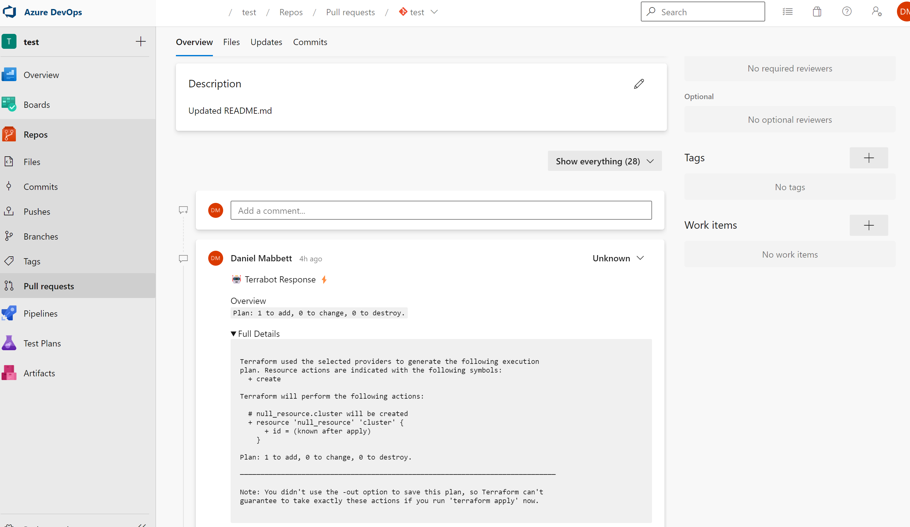

<div align="center">
  <a href="https://github.com/DanielMabbett/terrabot">
    
  </a>

  <h1 align="center">Terrabot</h1>

  <p align="center">
    Enhance your GitOps with Terrabot! Automate pushing Terraform Plans to your PRs for a streamlined review process.
    <br />
  </p>
</div>

<p align="center">
  <a href="https://goreportcard.com/report/github.com/danielmabbett/terrabot">
    
  </a>
  <a href="https://github.com/DanielMabbett/terrabot/actions/workflows/go.yml">
    
  </a>
</p>


## 🌟 Overview
Inspired by the [Atlantis](https://github.com/runatlantis/atlantis) project, Terrabot focuses on enhancing the review process in your GitOps workflow. While Atlantis provides a comprehensive suite of features, Terrabot specializes in delivering Terraform Plan insights directly into your Pull Requests, empowering reviewers with all the information they need at their fingertips.

## 🚀 Why Terrabot?
Unlike fully-fledged tools like Atlantis, Terrabot offers a lightweight, focused approach. It's designed to integrate seamlessly into your environment, especially beneficial for:

- **Security**: Operate within private networks. Terrabot runs on self-hosted agents behind firewalls, ensuring your infrastructure's security.
- **Simplicity**: Get started quickly. Terrabot's minimal setup means you spend less time configuring and more time delivering.
- **Visibility**: Improve your PR reviews. Terrabot brings the details of Terraform plans right into your pull requests, enhancing the review experience.

## 🛠️ Quick Install

```bash
curl https://raw.githubusercontent.com/DanielMabbett/terrabot/main/install.sh | bash
```

## 💡 Usage

### Terraform Example

```sh
# Output the text of your terraform plan
terraform plan -no-color > plan.txt

# Use terrabot to push the plan to Azure DevOps
terrabot push azure-devops \
--organisation "test" \
--project "test" \
--repo "test" \
--pull-request-id 1 \
--token "yourtoken" \
--plan test-plan.txt
```

### Terragrunt Example

```sh
# Output the text of your terragrunt plan
terragrunt run-all plan -no-color > plan.txt

# Use terrabot to push the plan to Azure DevOps
terrabot push azure-devops \
--organisation "test" \
--project "test" \
--repo "test" \
--pull-request-id 1 \
--token "yourtoken" \
--plan plan.txt \
--grunt
```

Then, effortlessly view the changes within your pull requests:



## 🤝 Contributing

Contributions make the open-source community a fantastic place to learn, inspire, and create. Any contributions you make are **greatly appreciated**. Check our [contributing guidelines](CONTRIBUTING.md) for more information.

```

Enhancements include:

1. **Emojis**: Add a visual touch and make the README more engaging.
2. **Badges**: Neatly align and present the badges.
3. **Sections**: Use emojis and bold headings to clearly demarcate sections.
4. **Descriptions**: Elaborate on the features and benefits to provide a clear understanding of what Terrabot offers.
5. **Formatting**: Ensure consistent use of code blocks and comments for clarity.

Feel free to adjust the content to better fit the project's specifics or personal preference!
