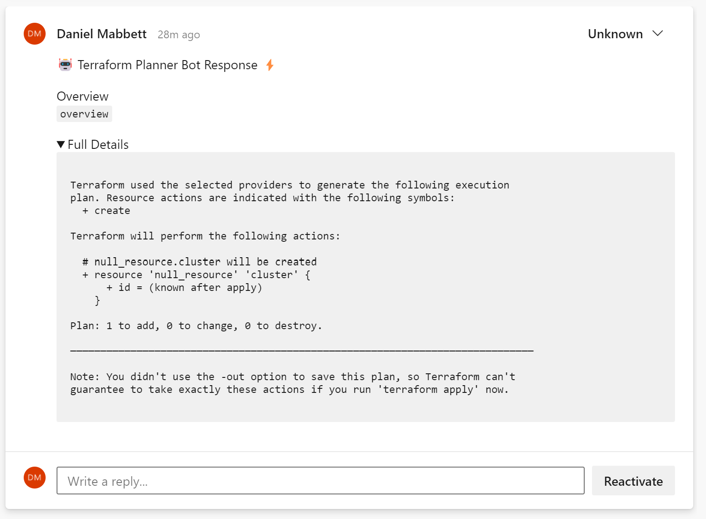

# terrabot

[](https://goreportcard.com/report/github.com/danielmabbett/terrabot)

[](https://github.com/DanielMabbett/terrabot/actions/workflows/go.yml)

Push Terraform Plans back to your PRs and make your process more gitops!

The idea originally came from the https://github.com/runatlantis/atlantis tool so check this out first and see if it fulfills your requirements.

## Why use terrabot?

This is not designed to be a fully "fleshed-out" tool such as Atlantis. 
It focuses only on sending a comment back to your pull request to let the reviewers know details of the intended changes. 

The advantages of a light weight tool such as *terrabot* is that you can run it on an agent/host which is not routeable to from public services (i.e. A self-hosted Azure DevOps agent that is behind a firewall).

## Usage

```sh
# Export the text of your terraform plan out
terraform plan -no-color > plan.txt

# Then run terrabot push azure-devops
# Note: For you to use this in an azure devops pipeline, make use of the pipeline variables 
# https://docs.microsoft.com/en-us/azure/devops/pipelines/build/variables?view=azure-devops&tabs=yaml
# set your PAC by export PAC=yourpac

terrabot push azure-devops \
--organisation "test" \
--project "test" \
--repo "test" \
--pull-request-id 1 \
--token "yourtoken" \
--plan test-plan.txt

```

Then it provides others in your pull requests with viewing the changes without having to leave the page:



## Contributors

Contributions are welcome!

